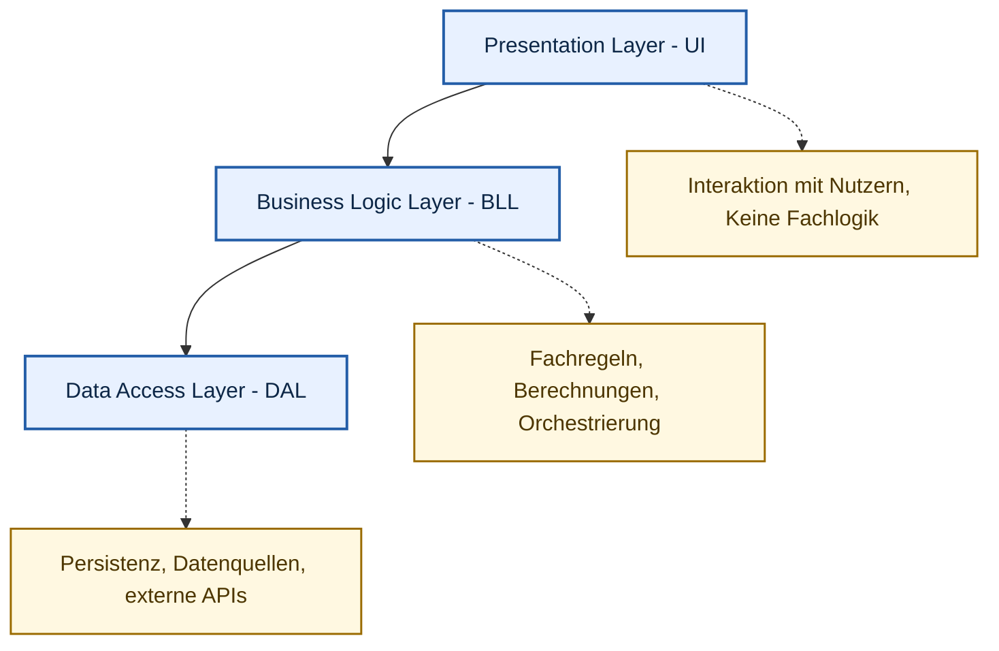
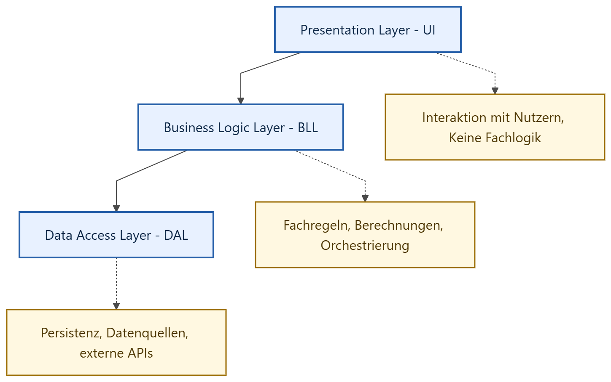
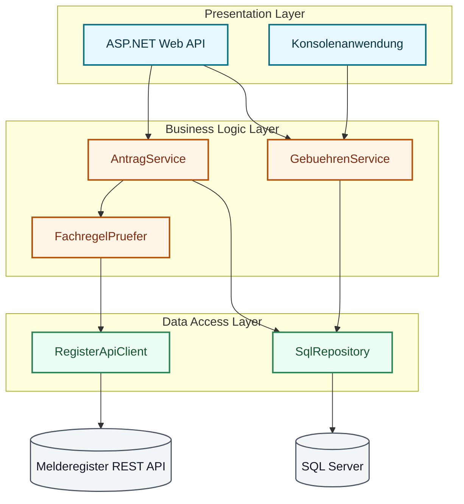

# Teil 1: Vom Code zum System

## Willkommen zu Woche 4

In den ersten Wochen haben wir die handwerklichen Details betrachtet: wie formatiere ich eine Methode, wie nutze ich ein Design Pattern.
Heute zoomen wir heraus. Wir betrachten die System-Architektur. Wie bauen wir ein gesamtes "Fachverfahren", das auch nach Jahren noch pflegbar bleibt?

## Ziele der heutigen Sitzung

- Die fünf SOLID-Prinzipien im Detail verstehen.
- Das Konzept der Dependency Injection (DI) meistern.
- Die klassische Schichtenarchitektur (UI, BLL, DAL) aufbauen können.
- Vor- und Nachteile architektonischer Entscheidungen abwägen.

## Was die Softwarearchitektur?

Die Softwarearchitektur ist die Struktur eines Softwaresystems, bestehend aus Komponenten, deren Beziehungen und den Prinzipien, die diese Struktur leiten.
Sie ist das Fundament, auf dem die Software aufgebaut ist. Eine gute Architektur ermöglicht es, dass das System flexibel, wartbar und erweiterbar bleibt, auch wenn sich die Anforderungen ändern.

## Was ist SOLID?

SOLID ist ein Akronym, das von Robert C. Martin ("Uncle Bob") geprägt wurde. Es fasst fünf essenzielle Prinzipien des objektorientierten Designs zusammen.
Wenn Ihr Code diese Prinzipien verletzt, wird das System im Laufe der Zeit starr, zerbrechlich und immobil ("Spaghetti-Code").
Befolgen Sie SOLID, bauen Sie Software, die flexibel und robust ist.

## Kritik an SOLID

- Manche Entwickler halten SOLID für zu theoretisch oder schwer anwendbar.
- Es gibt Fälle, in denen eine Verletzung eines SOLID-Prinzips pragmatisch sein kann (z.B. bei sehr kleinen Projekten).
- Dennoch ist es ein bewährtes Set von Richtlinien, das in der Praxis immer wieder seine Nützlichkeit bewiesen hat.

Die Prinzipien sind nicht als Dogma zu verstehen, sondern als Leitplanken, die uns helfen, bessere Software zu schreiben. Sie sind Werkzeuge, kein Gesetz.

# Teil 2: S – Single Responsibility Principle (SRP)

## SRP: Definition

*"Eine Klasse sollte nur genau einen Grund haben, sich zu ändern."*
Das bedeutet: Eine Klasse hat nur exakt eine einzige Verantwortlichkeit (Aufgabe) im System. Jede Änderung der Anforderungen sollte nur eine überschaubare Anzahl an Klassen betreffen.

## SRP: Das Problem der Gott-Klasse

Oft sehen wir in der Verwaltung Klassen wie den `AntragsManager`.
Was tut er? Er prüft die Fachregeln, er baut einen SQL-String zusammen und ruft die Datenbank auf, er formatiert das PDF für den Ausdruck.
Das ist eine "Gott-Klasse" – sie weiß alles und tut alles. Wenn sich das Datenbankschema ändert, müssen wir den AntragsManager ändern. Wenn sich das Layout des PDFs ändert, müssen wir ihn wieder ändern.

## SRP: Die *Gott-Klasse* ist ein Anti-Pattern

Eine ganz schlechte *Gott-Klasse*.
Eine Klasse mit einer Methode, die sowohl für die Prüfung der Fachregeln, das Zusammenbauen eines SQL-Strings und den Datenbankzugriff sowie das Erstellen des PDFs für den Ausdruck verantwortlich ist.

```csharp
public class AntragManager {
    public void BearbeiteAntrag(Antrag antrag) {
        // 1. Fachregeln prüfen
        bool fachregelnErfuellt = [...] // Logik zur Prüfung der Fachregeln
        if (!fachregelnErfuellt) {
            throw new Exception("Antrag erfüllt nicht die Fachregeln.");
        }

        // 2. SQL-String zusammenbauen
        string sql = "INSERT INTO Antraege ..."; // Logik zum Zusammenbauen des SQL-Strings

        // 3. Datenbankzugriff
        Datenbank.Execute(sql);

        // 4. PDF erstellen und drucken
        string pdfPfad = [...] // Logik zum Erstellen des PDFs;
        Drucker.Drucke(pdfPfad);
    }
}
```

## SRP: Die Lösung durch Dekomposition auf Methoden-Ebene

Die Klasse `AntragManager` hat jetzt zwar mehrere Methoden, aber sie ist immer noch eine "Gott-Klasse", weil sie immer noch alle Verantwortlichkeiten in sich vereint. Sie prüft die Fachregeln, baut den SQL-String zusammen, führt den Datenbankzugriff durch und erstellt das PDF. Es ist nur eine kleine Verbesserung, aber die Klasse ist immer noch schwer zu warten und zu erweitern.

```csharp
public class AntragManager {
    public void BearbeiteAntrag(Antrag antrag) {
        // 1. Fachregeln prüfen
        if (!PruefeFachregeln(antrag)) {
            throw new Exception("Antrag erfüllt nicht die Fachregeln.");
        }

        // 2. SQL-String zusammenbauen
        string sql = BaueSqlString(antrag);

        // 3. Datenbankzugriff
        Datenbank.Execute(sql);

        // 4. PDF erstellen und drucken
        string pdfContent = ErstellePdf(antrag);
        Drucker.Drucke(pdfContent);
    }

    private bool PruefeFachregeln(Antrag antrag) {
        // Logik zur Prüfung der Fachregeln
        return true; // Placeholder
    }

    private string BaueSqlString(Antrag antrag) {
        // Logik zum Zusammenbauen des SQL-Strings
        return "INSERT INTO Antraege ..."; // Placeholder
    }

    private string ErstellePdf(Antrag antrag) {
        // Logik zum Erstellen des PDFs
        return "PDF-Inhalt"; // Placeholder
    }
}
```

## SRP: Die Lösung durch Dekomposition auf Klassen-Ebene

Die Klasse `AntragManager` ist immer noch eine "Gott-Klasse", weil sie immer noch alle Verantwortlichkeiten in sich vereint. Die Lösung besteht darin, die Verantwortlichkeiten auf verschiedene Klassen zu verteilen. Jede Klasse hat nur eine einzige Verantwortlichkeit, und der `AntragManager` orchestriert nur die Zusammenarbeit der anderen Klassen.

```csharp
public class AntragManager {
    private readonly FachregelPruefer _fachregelPruefer = new FachregelPruefer();
    private readonly DatenbankService _datenbankService = new DatenbankService();
    private readonly PdfErsteller _pdfErsteller = new PdfErsteller();

    public void BearbeiteAntrag(Antrag antrag) {
        // 1. Fachregeln prüfen
        if (!_fachregelPruefer.Pruefe(antrag)) {
            throw new Exception("Antrag erfüllt nicht die Fachregeln.");
        }

        // 2. Datenbankzugriff
        _datenbankService.SpeichereAntrag(antrag);

        // 3. PDF erstellen und drucken
        string pdfContent = _pdfErsteller.ErstellePdf(antrag);
        Drucker.Drucke(pdfContent);
    }
}

public class FachregelPruefer {
    public bool Pruefe(Antrag antrag) {
        // Logik zur Prüfung der Fachregeln
        return true; // Placeholder
    }
}

public class DatenbankService {
    public void SpeichereAntrag(Antrag antrag) {
        // Logik zum Speichern des Antrags in der Datenbank
    }
}

public class PdfErsteller {
    public string ErstellePdf(Antrag antrag) {
        // Logik zum Erstellen des PDFs
        return "PDF-Inhalt"; // Placeholder
    }
}
```

## SRP: Die Lösung durch Dekomposition

Wir spalten die Gott-Klasse auf:

1. `FachregelPruefer`: Prüft nur die Fachregeln (z.B. ist der Bürger alt genug?).
2. `DatenbankService`: Kapselt nur den reinen Datenbankzugriff.
3. `PdfErsteller`: Kümmert sich ausschließlich um das Generieren des Dokuments.
4. `AntragsManager`: Orchestriert nur die Zusammenarbeit der anderen Klassen.

Jede Klasse hat nun nur noch **einen** Grund, sich zu ändern.

## SRP: Vorteile

- Erhöht die Lesbarkeit: Es ist sofort klar, welche Klasse für welche Aufgabe zuständig ist.
- Erhöht die Wartbarkeit: Änderungen an einer Verantwortlichkeit betreffen nur eine Klasse.
- Erleichtert die Testbarkeit: Jede Klasse kann isoliert getestet werden.
- Fördert die Wiederverwendbarkeit: Andere Teile des Systems können z.B. den `FachregelPruefer` nutzen, ohne sich um Datenbankzugriff oder PDF-Erstellung kümmern zu müssen.

# Teil 3: O – Open-Closed Principle (OCP)

## OCP: Definition

*"Software-Einheiten (Klassen, Module, Funktionen) sollten offen für Erweiterungen, aber geschlossen für Modifikationen sein."*
Das klingt wie ein Paradoxon: Wie erweitere ich ein System, ohne seinen Code zu verändern?

## OCP: In der Praxis

Wir haben dieses Prinzip beim **Strategy-Pattern** (Woche 3) kennengelernt!
Wenn wir eine neue Gebührensatzung für eine neue Stadt einführen wollen, passen wir nicht den bestehenden `GebuehrenRechner` an (geschlossen für Modifikation). Stattdessen schreiben wir eine völlig neue Klasse `SatzungLeipzig`, die ein Interface implementiert (offen für Erweiterung).

## OCP: Vorteile

- Durch OCP minimieren wir das Risiko, bei Erweiterungen bestehende, bereits getestete Funktionalität zu beschädigen (Regressionsfehler).
- Das System wird modular und lässt sich wie mit Legosteinen erweitern.
- Es fördert die Nutzung von Abstraktionen (Interfaces), was die Flexibilität erhöht.

# Teil 4: L – Liskov Substitution Principle (LSP)

## LSP: Definition

*"Objekte einer Unterklasse müssen sich so verhalten wie Objekte der Oberklasse, ohne dass das Programm fehlerhaft wird."*
Das bedeutet: Wer Vererbung nutzt, darf das zugesicherte Verhalten der Basisklasse nicht brechen.

Unterklassen sollten die Semantik der Basisklasse erweitern, aber niemals einschränken oder korrumpieren.

## LSP: Das Problem mit Exceptions

Stellen Sie sich vor, Sie haben ein Interface `IDokument` mit den Methoden `Speichern()` und `Drucken()`. Ein `BescheidDokument` kann sowohl speichern als auch drucken. Nun fügen Sie ein `DigitalOnlyDokument` hinzu, welches nur speichern kann.

Das bricht LSP! Eine Schleife, die über alle Dokumente geht und `Drucken()` aufruft, wird nun abstürzen.

```csharp
public interface IDokument {
    void Speichern();
    void Drucken();
}

public class BescheidDokument : IDokument {
    public void Speichern() { [...] }
    public void Drucken() { [...] }
}

public class DigitalOnlyDokument : IDokument {
    public void Speichern() { [...] }
    public void Drucken() {
        throw new NotImplementedException("Dieses Dokument kann nicht gedruckt werden.");
    }
}

static void Main() {
    List<IDokument> dokumente = new List<IDokument> {
        new BescheidDokument(),
        new DigitalOnlyDokument()
    };

    foreach (var doc in dokumente) {
        doc.Drucken(); // Hier wird die NotImplementedException ausgelöst!
    }
}
```

## LSP: Eine mögliche Lösung: Komposition statt Vererbung

Wenn eine Unterklasse eine Methode der Basisklasse nicht sinnvoll unterstützen kann, ist Vererbung oft das falsche Werkzeug.

Mit Komposition können wir die Funktionalität flexibel zusammenstellen, ohne die Verträge der Basisklasse zu verletzen. In unserem Beispiel könnten wir stattdessen ein separates Interface `IDruckbar` definieren, das nur die Dokumente implementieren, die tatsächlich druckbar sind.

```csharp
// Die Fähigkeiten werden in separate Interfaces aufgeteilt.
public interface ISpeicherbar {
    void Speichern();
}

public interface IDruckbar {
    void Drucken();
}

// Die Klassen implementieren nur, was sie wirklich können.
public class BescheidDokument : ISpeicherbar, IDruckbar {
    public void Speichern() { [...] }
    public void Drucken()   { [...] }
}

public class DigitalOnlyDokument : ISpeicherbar {
    public void Speichern() { [...] }
    // Kein Drucken – der Vertrag wird gar nicht erst versprochen
}

// Jetzt können wir nur die druckbaren Dokumente in einer Liste sammeln.
static void Main() {
    List<IDruckbar> druckbare = [ new BescheidDokument() ];
    foreach (var dok in druckbare)
        dok.Drucken(); // ✅ Kein Absturz möglich
}
```

## LSP: Vorteile

- Verhindert Laufzeitfehler durch ungültige Unterklassen.
- Fördert die Nutzung von Interfaces und Komposition.
- Erhöht die Flexibilität und Wiederverwendbarkeit von Code.

# Teil 5: I – Interface Segregation Principle (ISP)

## ISP: Definition

*"Clients sollten nicht dazu gezwungen werden, von Interfaces abzuhängen, die sie nicht benutzen."*
Es ist besser, viele kleine, spezifische Interfaces zu haben als ein riesiges, allgemeines.

## ISP: Das Problem "Fetter" Interfaces

Wenn Sie ein riesiges Interface `IDokument` haben, das `Drucke()`, `Speichere()`, `Validiere()`, und `Archiviere()` vorschreibt, zwingen Sie alle Klassen, all dies zu implementieren, auch wenn ein spezieller Vorgang z.B. gar nicht gedruckt werden kann.

Siehe das Beispiel in LSP: `DigitalOnlyDokument` muss eine `Drucken()`-Methode implementieren, obwohl sie diese Funktionalität nicht unterstützt. Das führt zu unübersichtlichem Code und potenziellen Laufzeitfehlern.

## ISP: Kleine, fokussierte Interfaces

Lösung: Trennen Sie in `IDruckbar`, `ISpeicherbar`, `IValidierbar`, etc.

Ein Modul für den Sachbearbeiter implementiert dann nur noch das, was es wirklich braucht. Dies erhöht die Übersichtlichkeit und reduziert unnötige Abhängigkeiten.

Siehe das Beispiel am Ende von LSP: `BescheidDokument` implementiert sowohl `ISpeicherbar` als auch `IDruckbar`, während `DigitalOnlyDokument` nur `ISpeicherbar` implementiert. So wird der Vertrag klar und es gibt keine ungenutzten Methoden.

## ISP: Vorteile

- Erhöht die Flexibilität und Wiederverwendbarkeit von Code.
- Verhindert die Implementierung von Methoden, die nicht benötigt werden.
- Erleichtert die Wartbarkeit und Testbarkeit von Klassen.

# Teil 6: D – Dependency Inversion Principle (DIP)

## DIP: Definition

*"Abhängigkeiten sollten gegen Abstraktionen gerichtet sein, nicht gegen konkrete Klassen."*
High-Level-Module (Fachlogik) sollten nicht von Low-Level-Modulen (Datenbank-Zugriff) abhängen. Beide sollten von Abstraktionen (Interfaces) abhängen.

## DIP: Die Umkehrung der Abhängigkeit

Traditionell ruft die Fachlogik die Datenbank direkt auf. DIP dreht das um: Die Fachlogik definiert ein Interface (`IDatenbank`), und die Datenbank-Schicht implementiert dieses Interface. Damit "besitzt" die Fachlogik die Definition ihrer Abhängigkeiten.

## DIP: Vorteile

- Erhöht die Flexibilität: Man kann die Implementierung der Datenbank wechseln, ohne die Fachlogik zu ändern.
- Erleichtert das Testen: Man kann leicht eine Mock-Datenbank bereitstellen, um die Fachlogik zu testen, ohne eine echte Datenbank zu benötigen.
- Fördert die lose Kopplung und die Einhaltung von SOLID-Prinzipien.


# Teil 7: Dependency Injection (DI)

## DI: Die Umsetzung des DIP

Das Dependency Inversion Principle führt uns zur Dependency Injection. DI ist eine Technik, um die Abhängigkeiten einer Klasse von außen bereitzustellen, anstatt dass die Klasse sie selbst erstellt oder hart verdrahtet.

Die Kernidee: "Frag nicht nach deinen Abhängigkeiten, lass sie dir geben." (*Hollywood-Prinzip*: Don't call us, we call you).

## DI vs. DIP

DIP ist das **Prinzip** (das Ziel: lose Kopplung über Abstraktionen).
DI ist die **Technik** (der Weg: wie kommen die Instanzen in die Klasse?).
DI ist also ein Werkzeug, um DIP im Code umzusetzen.

## DI: Enge Kopplung (Das Anti-Pattern)

In diesem Beispiel erstellt die Klasse ihre Abhängigkeit selbst. Sie ist "eng gekoppelt" an die konkrete Klasse `SqlDatenbank`.

```csharp
public class Fachverfahren
{
    // Die Abhängigkeit wird hart verdrahtet
    private SqlDatenbank _db = new SqlDatenbank(); 

    public void Verarbeite(Antrag a) 
    {
        _db.Save(a);
    }
}
```

## DI: Enge Kopplung im AntragsManager (Das Anti-Pattern)

Auch in unserem `AntragManager` haben wir eine enge Kopplung. Er erstellt selbst die Instanzen von `FachregelPruefer`, `DatenbankService` und `PdfErsteller`.

```csharp
public class AntragManager {
    private readonly FachregelPruefer _fachregelPruefer = new FachregelPruefer();
    private readonly DatenbankService _datenbankService = new DatenbankService();
    private readonly PdfErsteller _pdfErsteller = new PdfErsteller();

    [...]
}
```

## Warum enge Kopplung schlecht ist

Wie wollen wir diese Klasse jemals mit einer Mock-Datenbank (für Tests) aufrufen? Es ist unmöglich!

Zudem müsste bei einem Wechsel zu einer Oracle-Datenbank der Code des `Fachverfahrens` geändert werden, was OCP verletzt.

Man sollte die Klasse nicht zwingen, von einer konkreten Implementierung abhängig zu sein. Das macht sie starr und schwer erweiterbar.

## DI: Lose Kopplung (Die Lösung)

Wir verlangen eine Abstraktion (Interface) über den Konstruktor.

```csharp
public class Fachverfahren
{
    private readonly IDatenbank _db;

    // Konstruktor-Injection: Wir lassen uns die DB geben
    public Fachverfahren(IDatenbank db) 
    {
        _db = db;
    }

    public void Verarbeite(Antrag a) => _db.Save(a);
}
```

## DI: Lose Kopplung im AntragsManager (1/4)

Zuerst definieren wir Interfaces für die Abhängigkeiten. Das sind reine Verträge, die keine Implementierung enthalten.

Die konkreten Klassen implementieren diese Interfaces, aber der `AntragManager` kennt nur die Interfaces.

```csharp
public interface IFachregelPruefer {
    bool Pruefe(Antrag antrag);
}

public interface IDatenbankService {
    void SpeichereAntrag(Antrag antrag);
}

public interface IPdfErsteller {
    string ErstellePdf(Antrag antrag);
}

public class FachregelPruefer : IFachregelPruefer { [...] }

public class DatenbankService : IDatenbankService { [...] }

public class PdfErsteller : IPdfErsteller { [...] }
```

## DI: Lose Kopplung im AntragsManager (2/4)

Die Klasse `AntragManager` erhält ihre Abhängigkeiten über den Konstruktor. Sie kennt nur die Interfaces, nicht die konkreten Implementierungen. Das macht sie flexibel und testbar.

Dieses Verfahren nennt man **Constructor Injection**. Es ist die gebräuchlichste Form der Dependency Injection.

```csharp
public class AntragManager {
    private readonly IFachregelPruefer _fachregelPruefer;
    private readonly IDatenbankService _datenbankService;
    private readonly IPdfErsteller _pdfErsteller;

    public AntragManager(IFachregelPruefer fachregelPruefer, IDatenbankService datenbankService, IPdfErsteller pdfErsteller) {
        _fachregelPruefer = fachregelPruefer;
        _datenbankService = datenbankService;
        _pdfErsteller = pdfErsteller;
    }

    public void BearbeiteAntrag(Antrag antrag) { [...] }
}
```

## DI: Lose Kopplung im AntragsManager (3/4)

Im Hauptprogramm oder in der Startup-Klasse konfigurieren wir, welche konkreten Implementierungen für welche Interfaces verwendet werden sollen. Man "baut" das System einmalig zusammen. Dieser Vorgang wird als "Composition Root" bezeichnet.

```csharp
static void Main() {
    // Manuelles Zusammenbauen der Abhängigkeiten
    IFachregelPruefer fachregelPruefer = new FachregelPruefer();
    IDatenbankService datenbankService = new DatenbankService();
    IPdfErsteller pdfErsteller = new PdfErsteller();

    AntragManager antragManager = new AntragManager(fachregelPruefer, datenbankService, pdfErsteller);

    Antrag antrag = new Antrag(); // Beispielantrag
    antragManager.BearbeiteAntrag(antrag);
}
```

## DI-Container: Das Herz moderner Anwendungen

Das manuelle Konfigurieren der Abhängigkeiten im "Composition Root" ist bei kleinen Projekten machbar, aber bei größeren Systemen mit vielen Abhängigkeiten schnell unübersichtlich.

In modernen Frameworks (wie ASP.NET Core) müssen wir nicht hunderte Male `new` aufrufen, um die Klassen zusammenzustecken.
Eine spzeielle Software, **DI-Container** (oder IoC-Container) genannt, übernimmt das.

## Funktionsweise eines DI-Containers

Beim Programmstart registrieren wir Typen: *"Wann immer jemand eine `IDatenbank` benötigt, erzeuge eine Instanz von `SqlDatenbank` und gib sie ihm."*
Der Container speichert diese Regeln und erstellt die Objekte automatisch, wenn sie benötigt werden. Er löst die Abhängigkeiten rekursiv auf: Wenn `AntragManager` eine `IDatenbank` braucht, fragt er den Container, der dann eine `SqlDatenbank` erstellt. Wenn `SqlDatenbank` wiederum eine `ILogger` benötigt, fragt er den Container erneut, und so weiter.

Der Container löst also den gesamten Abhängigkeitsbaum automatisch auf, egal wie tief er verschachtelt ist.

## DI: Lose Kopplung im AntragsManager (4/4)

Zum Schluss sieht unser Hauptprogramm so aus. Es ist extrem schlank, weil der DI-Container die ganze Arbeit erledigt. Wir müssen nur einmal angeben, welche Implementierungen wir für welche Interfaces verwenden wollen.

```csharp
static void Main() {
    // Zusammenbauen der Abhängigkeiten mittels DI-Container
    var services = new ServiceCollection();
    services.AddTransient<IFachregelPruefer, FachregelPruefer>();
    services.AddTransient<IDatenbankService, DatenbankService>();
    services.AddTransient<IPdfErsteller, PdfErsteller>();
    services.AddTransient<AntragManager>();
    var serviceProvider = services.BuildServiceProvider();

    AntragManager antragManager = serviceProvider.GetRequiredService<AntragManager>();

    Antrag antrag = new Antrag(); // Beispielantrag
    antragManager.BearbeiteAntrag(antrag);
}
```

## Vorteile von Constructor Injection

1. **Transparenz:** Man sieht sofort, was die Klasse zum Arbeiten benötigt.
2. **Testbarkeit:** Im Unit Test können wir einfach ein Mock-Objekt übergeben.
3. **Unveränderlichkeit:** Durch `readonly` stellen wir sicher, dass die Abhängigkeit nach der Initialisierung nicht mehr geändert wird.

# Teil 8: Schichtenarchitektur

## Layered Architecture (Schichtenarchitektur)

Wenn Fachverfahren wachsen, brauchen sie eine grobe Struktur. Wir teilen den Code in logische Schichten (Layers).

Die drei klassischen Schichten sind:

1. **Presentation Layer (UI):** Das Gesicht der Anwendung.
2. **Business Logic Layer (BLL):** Das Gehirn der Anwendung (Fachlogik).
3. **Data Access Layer (DAL):** Das Gedächtnis der Anwendung (Datenhaltung).

Die absolut wichtigste Regel: **Abhängigkeiten zeigen immer nur in eine Richtung, von oben nach unten.**

## Visualisierung: Schichtenarchitektur





Die Pfeile zeigen die erlaubte Abhängigkeitsrichtung: **nur von oben nach unten**.

## Presentation Layer (User Interface)

Diese Schicht kümmert sich um die Interaktion mit dem Nutzer.

- Typen: Console-App, WPF Desktop-App, ASP.NET Web API.
- Darf **nur** die Business-Schicht aufrufen.
- Enthält **keine** Geschäftsregeln (z.B. keine Gebührenberechnung).

## Business Logic Layer (BLL)

Hier sitzt das eigentliche Fachwissen der Behörde.

- Prüft Gesetze, führt Berechnungen aus, orchestriert Workflows.
- Darf **nur** auf die Data Access Schicht zugreifen.
- Ist unabhängig von der UI (kann im Web oder auf der Konsole exakt gleich genutzt werden!).

## Data Access Layer (DAL)

Kümmert sich rein um das Speichern und Laden von Daten.

- Verbindungen zur SQL-Datenbank, Lesen von XML-Dateien, Aufruf von externen REST-APIs.
- Kennt keine andere Schicht. Darf keine Fachlogik enthalten.

## Praxisbeispiel: Schichtenarchitektur




Beobachtung: Die Aufrufe verlaufen nur von oben nach unten; UI ruft keine DAL-Komponenten direkt auf.

## Vorteile der Schichtenarchitektur

- **Austauschbarkeit:** Die Web-UI kann durch eine Mobile-App ersetzt werden, ohne die Fachlogik anzufassen.
- **Testbarkeit:** Wir können die BLL testen, indem wir den DAL weg-mocken.
- **Wartbarkeit:** Klare Strukturen helfen neuen Entwicklern, sich schnell zurechtzufinden.

## Nachteile der Schichtenarchitektur

- **Overhead:** Für sehr kleine Anwendungen (CRUD) wirkt die Trennung oft übertrieben ("Code-Vervielfältigung").
- **Performance:** Theoretisch minimaler Overhead durch die vielen Aufrufe über Schichtgrenzen hinweg (in der Praxis meist vernachlässigbar).

## Praxis-Beispiel: Projektstruktur in .NET

So sieht eine saubere Solution in Visual Studio aus:

```text
Solution: BehoerdenFachverfahren
├── Projekt.UI (Console App)
│   └── Referenziert Projekt.Business
│
├── Projekt.Business (Class Library)
│   ├── Interfaces (z.B. IDatenbank, IAntragService)
│   ├── Models (z.B. Antrag, Buerger)
│   ├── Services (Fachlogik)
│   └── Referenziert Projekt.Data
│
└── Projekt.Data (Class Library)
    ├── SqlRepository (Implementiert IDatenbank)
    └── Referenziert keine anderen Projekte!
```

## Das Geheimnis der Abstraktion

Wie kann der Business-Layer die Datenbank aufrufen, wenn die Abhängigkeit nach unten zeigt?
Indem der Business-Layer die **Interfaces** definiert (z.B. `IDatenbank`), und der Data-Layer diese Interfaces **implementiert**.
Das ist die perfekte Anwendung des Dependency Inversion Principles!

## Reality Check: Schichtenarchitektur in der Praxis

Die klassische Schichtenarchitektur ist immer noch weit verbreitet.

Neben der klassischen Schichtenarchitektur gibt es auch andere Architekturstile (z.B. Hexagonal Architecture, Clean Architecture), die ähnliche Prinzipien verfolgen, aber mit anderen Schichtbezeichnungen und Abhängigkeitsregeln arbeiten.

Die Grundidee bleibt jedoch immer die gleiche:

- lose Kopplung,
- klare Verantwortlichkeiten und
- die Einhaltung von SOLID-Prinzipien.

# Teil 9: Zusammenfassung

## Wrap-up Woche 4

- **SOLID-Prinzipien** bewahren Code vor dem schleichenden Verfall und ermöglichen nachhaltige Software.
- **Dependency Injection** sorgt für lose Kopplung und ist die Voraussetzung für moderne, testbare Architekturen.
- Die **Schichtenarchitektur** trennt UI, Fachlogik und Datenhaltung strikt voneinander und erlaubt den isolierten Austausch von Komponenten.

## Ausblick auf Woche 5

Wir haben nun gelernt, wie man Architekturen baut, die "testbar" sind.
In der nächsten Woche schauen wir uns an, wie wir dieses Potenzial nutzen: Wir steigen in das **Automatisierte Unit Testing** mit xUnit und in das **Test-Driven Development (TDD)** ein.
