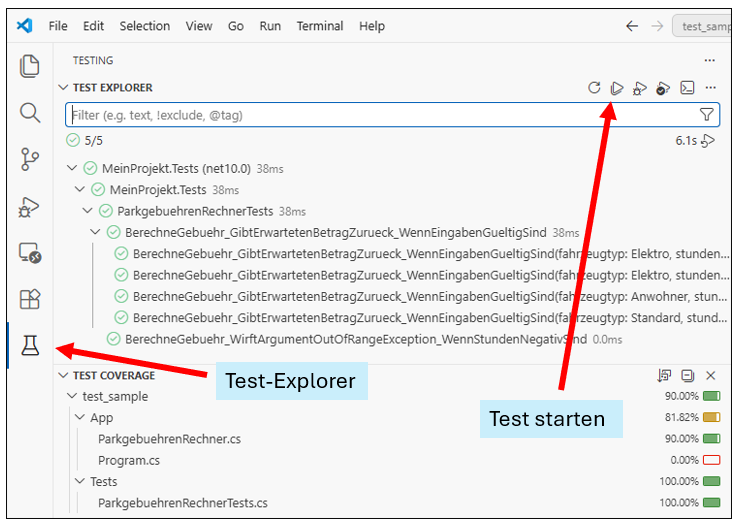

# Übungsaufgabe Woche 5: Unit Testing & TDD

## Setup

So legen Sie eine Konsolenanwendung mit einem xUnit-Testprojekt an:

- Erstellen Sie ein neues Verzeichnis
- Öffnen Sie die Kommandozeile in dem Verzeichnis.
- Führen Sie den folgenden Befehl aus, um ein neues (leeres) Projekt zu erstellen. Sie können den Namen `MeinProjekt` natürlich anpassen:

  ```bash
  dotnet new sln -n MeinProjekt
  ```

- Erstellen Sie eine Konsolenanwendung im Unterverzeichnis `App`:

  ```bash
  dotnet new console -n MeinProjekt.App -o App
  ```

- Erstellen Sie ein xUnit-Testprojekt im Unterverzeichnis `Tests`:

  ```bash
  dotnet new xunit -n MeinProjekt.Tests -o Tests
  ```

- Fügen Sie beide Projekte zur Lösung hinzu:

  ```bash
  dotnet sln MeinProjekt.slnx add App/MeinProjekt.App.csproj
  dotnet sln MeinProjekt.slnx add Tests/MeinProjekt.Tests.csproj
  ```

- Fügen Sie eine Projektverweis von `Tests` auf `App` hinzu, damit die Tests auf die Klassen der App zugreifen können:

  ```bash
  dotnet add Tests/MeinProjekt.Tests.csproj reference App/MeinProjekt.App.csproj
  ```

- Prüfen Sie, ob alles geklappt hat, indem Sie im Hauptverzeichnis die Tests ausführen:

  ```bash
  dotnet test
  ```

- Fertig :-)

> **Hinweis:** Eigentlich würden man in einem echten Projekt zusätzlich eine Bibliothek anlegen und die Geschäftslogik darin ablegen, aber für die Übung ist eine Konsolenanwendung allein ausreichend.

## Test durchführen

Auf der **Kommandozeile** können Sie die Tests mit `dotnet test` ausführen.

In **Visual Studio Code** können Sie die Tests mit der Test-Explorer-Erweiterung ausführen.

Diese Erweiterung müsste automatisch erkannt werden, wenn Sie die Testprojekte angelegt haben und VSC im Hauptverzeichnis geöffnet ist.

Sie können dann entweder alle Tests oder einzelne Tests ausführen.



## Aufgabe 1: Parkgebühren-Tester

### Szenario

Sie haben eine Klasse `ParkgebuehrenRechner` (siehe unten), die basierend auf dem Fahrzeugtyp und der Dauer die Gebühren wie folgt berechnet:

- Standard: 2,00 EUR / Stunde
- Elektro-Fahrzeuge: 1,00 EUR / Stunde (Umweltbonus)
- Anwohner: Kostenlos (0,00 EUR)

### Die Klasse `ParkgebuehrenRechner`

```csharp
public enum Fahrzeugtyp
{
   Standard,
   Elektro,
   Anwohner
}

public class ParkgebuehrenRechner
{
   public decimal BerechneGebuehr(Fahrzeugtyp fahrzeugtyp, int stunden)
   {
      if (stunden < 0)
      {
         throw new ArgumentOutOfRangeException(nameof(stunden), "Stunden duerfen nicht negativ sein.");
      }

      decimal preisProStunde = fahrzeugtyp switch
      {
         Fahrzeugtyp.Standard => 2.00m,
         Fahrzeugtyp.Elektro => 1.00m,
         Fahrzeugtyp.Anwohner => 0.00m,
         _ => throw new ArgumentOutOfRangeException(nameof(fahrzeugtyp))
      };

      return preisProStunde * stunden;
   }
}
```

### Aufgabe

Erstellen Sie ein xUnit-Testprojekt und schreiben Sie Tests für die folgenden Fälle:

1. **Standard:** Ein normales Fahrzeug parkt 3 Stunden -> Erwartet: 6,00 EUR.

2. **Elektro:** Ein E-Auto parkt 2 Stunden -> Erwartet: 2,00 EUR.
3. **Anwohner:** Ein Anwohner parkt 10 Stunden -> Erwartet: 0,00 EUR.
4. **Edge-Case:** Ein E-Auto parkt 0 Stunden -> Erwartet: 0,00 EUR.
5. **Negative Werte:** Was passiert bei -1 Stunden? Überlegen Sie sich ein sinnvolles Verhalten (z.B. Exception werfen oder 0 zurückgeben).

### Ziel

Sie sollen das **AAA-Pattern** (Arrange, Act, Assert) anwenden und sowohl `[Fact]` als auch `[Theory]` für die Tests nutzen.

```csharp
// Im Testprojekt:

public class ParkgebuehrenRechnerTests
{
   // Ihre Tests folgen hier...
}
```

## Aufgabe 2: TDD - Warteschlangen-Manager für ein Amt

### Szenario

In einem Amt wird eine einfache Warteschlange benoetigt. Implementieren Sie eine Klasse `WarteschlangenManager` streng nach **TDD**.

Die Klasse soll das folgende Interface `IWarteschlangenManager` implementieren.

```csharp
public interface IWarteschlangenManager
{
   public int TicketZiehen(string name);
   public string NaechstenAufrufen();
   public int AnzahlWartende();
}
```

### Fachregeln

1. Beim Ziehen eines Tickets darf `name` nicht leer oder nur aus Leerzeichen bestehen, sonst soll eine `ArgumentException` geworfen werden.
2. `TicketZiehen(string name)` gibt die aktuelle Anzahl wartender Personen zurück (inklusive der neu hinzugefügten Person).
3. `NaechstenAufrufen()` gibt den Namen der Person zurück, die am längsten wartet (FIFO).
4. Wird `NaechstenAufrufen()` bei leerer Warteschlange aufgerufen, soll der Text "`niemand`" zurückgegeben werden.
5. `AnzahlWartende()` liefert die aktuelle Anzahl wartender Personen.

### Aufgabe

Arbeiten Sie in kleinen Schritten nach **Red -> Green -> Refactor**:

1. Ermitteln Sie anhand der Spezifikation (Fachregeln) die notwendigen Testfälle.  

   > **Hinweis:** Um die Aufgabe in einem angemessenen Zeitrahmen zu lösen, konzentrieren Sie sich auf die Mindest-Testfälle (siehe unten).
2. Schreiben Sie im Testprojekt zuerst einen fehlschlagenden Test für eine Fachregel.
3. Implementieren Sie in der Konsolenanwendung nur so viel Code, dass der Test grün wird.
4. Refaktorisieren Sie den Code der Konsolenanwendung, ohne das Verhalten zu ändern, d.h. der Test muss weiterhin grün bleiben.
5. Erweitern Sie den Test um einen weiteren Testfall für die nächste Fachregel und so weiter, bis alle Fachregeln abgedeckt sind.

### Mindest-Testfälle

1. Ein gültiger Name wird leerer Warteschlange hinzugefuegt, `TicketZiehen` gibt 1 zurueck.

2. Ein gültiger Name wird hinzugefuegt, `AnzahlWartende()` erhöht sich um 1.
3. Zwei Namen werden hinzugefuegt, Aufrufreihenfolge ist FIFO.
4. `NaechstenAufrufen()` auf leerer Warteschlange gibt "niemand" zurück.
5. Leerer oder whitespace-Name bei `TicketZiehen` wirft `ArgumentException`.

> **Hinweis:** Eine entsprechende Testklasse mit diesen Testfällen ist bereits vorgegeben. Sie können die Tests in beliebiger Reihenfolge implementieren, aber es ist empfehlenswert, mit den Happy-Path-Tests zu beginnen und dann schrittweise die Edge-Cases (Fehlerfälle) abzuarbeiten.

### Ziel

Der Fokus liegt auf dem TDD-Prozess, nicht auf einer grossen Menge an Produktivcode.

### Testklasse

```csharp
using System;
using Xunit;

// Im Testprojekt:

public class WarteschlangenManagerTddTests
{
   [Fact]
   public void TicketZiehen_Gibt1Zurueck_WennErsterGueltigerNameHinzugefuegtWird()
   {
      var sut = new WarteschlangenManager();
      var ticketNumber = sut.TicketZiehen("Anna");
      Assert.Equal(1, ticketNumber);
   }

   [Fact]
   public void AnzahlWartende_Gibt1MehrZurueck_WennEinGueltigerNameHinzugefuegtWird()
   {
      // Ihre Lösung ist gefragt...
   }

   [Fact]
   public void NaechstenAufrufen_GibtNamenInFifoReihenfolgeZurueck_WennZweiNamenWarten()
   {
      // Ihre Lösung ist gefragt...
   }

   [Fact]
   public void NaechstenAufrufen_GibtNiemandZurueck_WennWarteschlangeLeerIst()
   {
      // Ihre Lösung ist gefragt...
   }

   [Theory]
   [InlineData("")]
   [InlineData("   ")]
   public void TicketZiehen_WirftArgumentException_WennNameLeerOderWhitespaceIst(string name)
   {
      var sut = new WarteschlangenManager();
      Assert.Throws<ArgumentException>(() => sut.TicketZiehen(name));
   }
}
```
